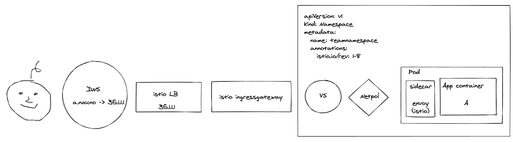
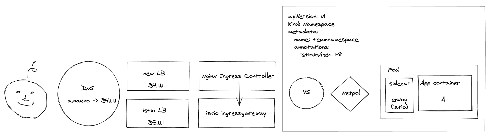
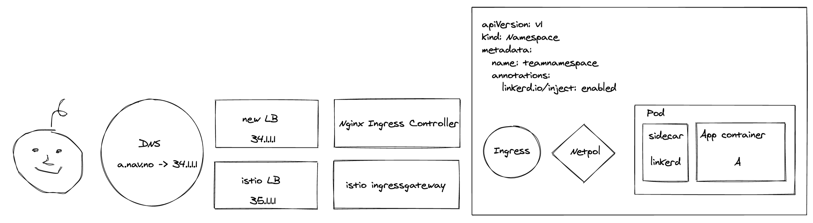
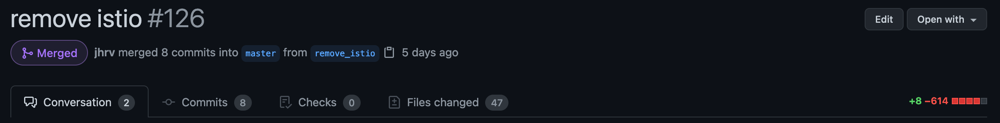
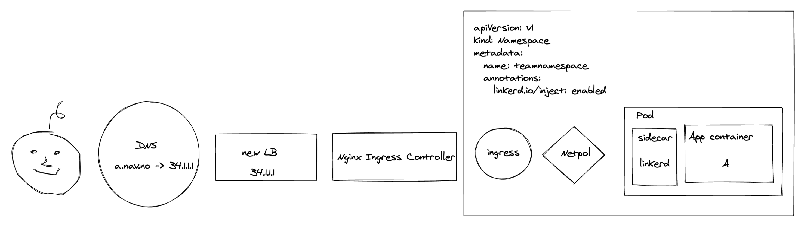

## Why change?

With an ambition of making our environments as secure as possible, we jumped on the service-mesh bandwagon in 2018 with Istio 0.7 and have stuck with it since.

Istio is a large and feature rich system that brings capabilities aplenty.
Although there are a plethora of nifty and useful things we could do with Istio, we've primarily used it for mTLS and authorization policies.

One might think that having lots of features available but not using them couldn't possibly be a problem.
However, all these extra capabilities comes with a cost - namely complexity; and we've felt encumbered by this complexity every time when configuring, maintaining or troubleshooting in our clusters.
Our suspicions were that since we hardly used any of the capabilities, we could probably make do with a much simpler alternative.
So, and after yet another _"Oh... This problem was caused by Istio!"_-moment, we decided the time was ripe to consider the alternatives out there.

We looked to the grand ol' Internet for alternatives and fixed our gaze on the rising star Linkerd 2.
Having honed in on our preferred candidate, we decided to take it for a quick spin in a cluster and found our suspicions to be accurate.

Rarely has a meme depicted a feeling more strongly


Even though we'd invested a lot of time and built in quite a bit of Istio into our platform, we knew we had to make the change.

## How did we do it?

### Original architecture:

Let's first have a quick look at what we were dealing with:

The first thing an end user encountered was our Google LoadBalancer configured by an IstioOperator.
The traffic was then forwarded to the Istio Ingressgateway, who in turn sent it along via an mTLS connection to the application.
Before the Ingressgateway could reach the application, both NetworkPolicies and AuthorizationPolicies were required to allow the traffic.
We used an [operator](https://github.com/nais/naiserator) to configure these policies when an application was deployed.



### New LoadBalancers and ingress controllers

Since our LoadBalancers were configured by (and sent traffic to) Istio, we had to change the way we configured them.
Separating LoadBalancing from mesh is a healthy separation of concern that will give us greater flexibility in the future as well.
We also had to swap out Istio Ingressgateway with an Ingress Controller - we opted for NGINX.

We started by creating IP-addresses and Cloud Armor security policies for our new LoadBalancers with [Terraform](https://www.terraform.io/).

The loadbalancers themselves were created by an Ingress object:

```yaml
apiVersion: networking.k8s.io/v1beta1
kind: Ingress
metadata:
  annotations:
    networking.gke.io/v1beta1.FrontendConfig: <tls-config>
    kubernetes.io/ingress.global-static-ip-name: <global-ip-name>
    kubernetes.io/ingress.allow-http: "false"
  name: <loadbalancer-name>
  namespace: <ingress-controller-namespace>
spec:
  backend:
    serviceName: <ingress-controller-service>
    servicePort: 443
  tls:
    - secretName: <kubernetes-secret-with-certificates>
```

We tied the Cloud Armor security policy to the Loadbalancer with a `BackendConfig` on the Ingress Controller's service:

```yaml
apiVersion: v1
kind: Service
metadata:
  annotations:
    cloud.google.com/app-protocols: '{"https": "HTTP2"}'
    cloud.google.com/backend-config: '{"default": "<backendconfig-name>"}'
    cloud.google.com/neg: '{"ingress": true}'
    ...
---
apiVersion: cloud.google.com/v1
kind: BackendConfig
metadata:
  name: <backendconfig-name>
spec:
  securityPolicy:
    name: <security-policy-name>
  ...
```

Alrighty. We'd now gotten ourselves a brand new set of independantly configured LoadBalancers and a shiny new Ingress Controller.


However - if we'd started shipping traffic to the new components at this stage, things would start breaking as there were no ingresses in the cluster - only VirtualServices.
To avoid downtime, we created an interim ingress that forwarded all traffic to the Istio IngressGateway:

```yaml
apiVersion: networking.k8s.io/v1beta1
kind: Ingress
spec:
  rules:
  - host: '<domain-name>'
    http:
      paths:
      - backend:
          serviceName: <istio-ingressgateway-service>
          servicePort: 443
        path: /
  ...
```


With this ingress in place, we could reach all the existing VirtualServices exposed by the Istio Ingressgateway via the new Loadbalancers and Nginx.
And we could point our DNS records to the new rig without anyone noticing a thing.

### Migrating workloads from Istio to Linkerd

Once LoadBalancing and ingress traffic were closed chapters, we changed our attention to migrating workloads from Istio to Linkerd.
When moving a workload to a new service-mesh, there's a bit more to it than swapping out the sidecar with a new namespace annotation.
Our primary concerns were:

- The new sidecar would require NetworkPolicies to allow traffic to and from linkerd.
- The application's VirtualService would have to be transformed into an Ingress.
- Applications that used [scuttle](https://github.com/redboxllc/scuttle) to wait for the Istio sidecar to be ready had to be disabled.
- We couldn't possibly migrate all workloads simultaneously due to scale.
- Applications have to communicate, but they can't when they're in different service-meshes.

Since applications have a tendency of communicating with eachother, and communication between different service-meshes was a bit of a bother, we decided to migrate workloads based on who they were communicating with to avoid causing trouble.
Using the NetworkPolicies to map out who were communicating with whom, we found a suitable order to migrate workloads in.

We then gave this list to our [operator](https://github.com/nais/naiserator), who in turn removed Istio resources, updated NetworkPolicies, created Ingresses and restarted workloads.
Slowly but surely our linkerd dashboard was starting to populate, and the only downtime was during the seconds it took for the first Linkerd pod to be ready.
One thing we didn't take into concideration (but should have), was that some applications shared a hostname.
When an ingress was created for a shared hostname, Nginx would stop forwarding requests for these hosts to Istio Ingressgateway, resulting in non-migrated applications not getting any traffic.
Realizing this, we started migrating applications on the same hostname simultaneously too.


And within a couple of hours, all workloads were migrated and we had ourselves a brand spanking new service-mesh in production.
And then they all lived happily ever after...

Except that we had to clean up Istio's mess.

### Cleaning up

What was left after the party was a fully operational Istio control plane, a whole bunch of Istio CRD's and a completely unused set of LoadBalancers. In addition we had to clean up everything related to Istio in a whole lot of pipelines and components




It has to be said - there is a certain satisfaction in cleaning up after a party that has been going on for too long.
