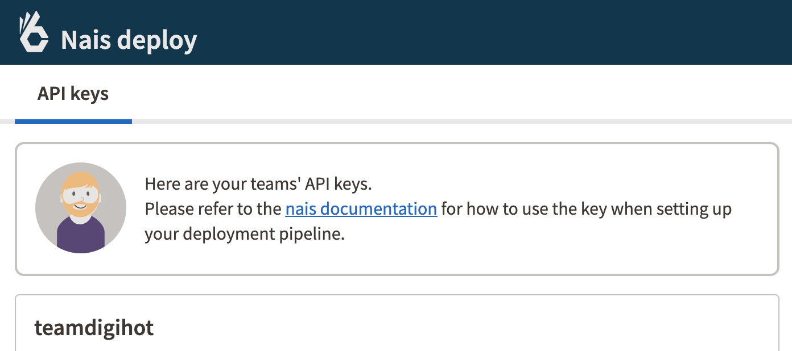
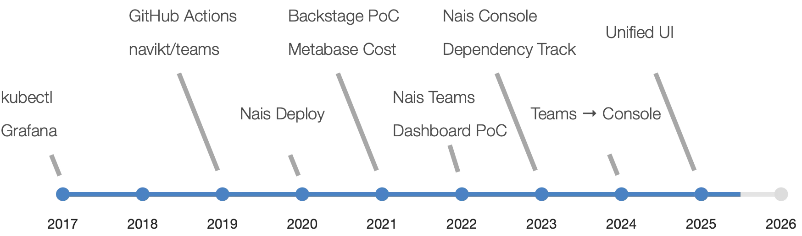

Nais has always been a platform for technically skilled developers building applications. The vision has been to let developers stay in their flow, using the tools they prefer, while minimizing the need to interact with the platform itself. In other words, the goal has never been about maximizing page views or time spent on the platform.

Our primary interfaces are documentation and configuration as code (`nais.yaml`), where developers define how their applications should run on Nais. This integrates seamlessly with their workflows using GitHub Actions. Additionally, we’ve provided tools like Prometheus and Grafana for dashboards, Kibana for logs, and kubectl for troubleshooting. These tools have served us well for a long time.

Over time, we’ve built specialized interfaces for managing different parts of the platform, such as Nais Deploy for API keys and deployment status, Nais Teams for team registration and access management, Metabase for cost insights, and Dependency Track for vulnerability tracking.



<small>Screenshot of Nais Deploy user interface</small>

However, as the platform has grown to support hundreds of teams and nearly 2,000 applications, we’ve seen a diverse range of users with varying backgrounds and needs. There’s also an expectation for a more unified and streamlined user experience compared to when we started building Nais nearly a decade ago.



<small>Timeline of various Nais interfaces and tools</small>

In the summer of 2023, we took a big step in this direction by introducing Nais Console – a developer portal providing an overview of applications. Six months later, we added vulnerability and cost insights directly into the Console, eliminating the need for two separate tools. By 2024, Deploy key management from Nais Deploy, team administration, and a complete view of external resources defined in Nais manifests were also integrated.

## Nais Console Today

Today, Nais Console serves as a central tool for delivering relevant information to the right person at the right time. It integrates data from Kubernetes, Prometheus, and other sources, giving developers a comprehensive view of their application resources, costs, and vulnerabilities – all without switching between multiple tools. This enables better decision-making for application operations and improvements.


The Console also acts as a key UI for showcasing what the Nais platform offers. While much of the technical complexity is hidden, the Console becomes especially important for "day two" operations – when applications are running, and developers who may not prefer command-line tools like kubectl need an accessible entry point. The goal is to democratize information and empower all developers to manage their applications effectively, focusing on what’s relevant to their needs.

User feedback has been positive, with many teams using the Console alongside tools like Grafana and kubectl. The homepage provides an overview of teams and critical alerts, while detailed pages offer insights into resource usage and recent activity. Many users have discovered vulnerabilities and costs they were previously unaware of, leading to behavioral changes. While there’s still room for improvement, the Console has become a natural part of daily workflows for many development teams.

## Platform as a Product

We build the Nais platform using modern product development principles, with a strong focus on developer experience. Our platform team operates as an autonomous product team, responsible for both infrastructure and the developer portal. We treat the platform as a product with end users, not just a technical tool for organizational needs. This involves continuous user involvement, rapid iterations, and a constant focus on delivering value to developers.

A key part of this effort has been training and onboarding. We’ve run dedicated courses for employees and consultants to get started with the Console quickly and introduced new routines and tools for better insights and control. The platform and Console are managed by the same team, but responsibilities are divided into smaller areas to work efficiently and purposefully. User feedback plays a central role in prioritizing further development.

One of the Console’s strengths is its ability to meet diverse needs and support complex user journeys. To maximize its value, we’re working on tighter integration with documentation, making it easier to understand how to use platform features. We recognize that some users need more guidance, so we prioritize clarity, context, and support where needed.

## The Technology Behind Nais Console

The architecture of Nais Console is designed to scale and provide real-time insights into complex systems. At its core is the Nais API, which connects to all Kubernetes clusters and services like Prometheus. Initially, the system used an asynchronous approach for data collection and processing, but it has since transitioned to direct connections for more up-to-date and reliable information.

For data collection and synchronization, we use Kubernetes Informers, which subscribe to specific changes in the cluster, such as pod events or resource updates. This event-driven model allows real-time updates in the Console without unnecessary system queries. Changes are captured and sent to the API, which uses Reconcilers to ensure the system’s actual state matches the desired state.

Internally, we use Protocol Buffers (protobuf) for efficient data serialization, while externally, data is exposed via a GraphQL API. This allows clients to fetch only the data they need, avoiding unnecessary overhead. This setup provides flexibility and efficiency for both the frontend application and external integrations. In the future, we plan to open the API for broader use, including custom integrations and CLI tools.

The Console’s frontend is built with Svelte, a modern and reactive JavaScript framework that balances high performance with low complexity. We also use Houdini, a GraphQL tool that simplifies caching and data management on the client side. Below is an example of how Houdini is used in the Nais Console frontend to fetch and display team information:

```svelte
<script lang="ts">
  import { graphql } from '$houdini';
  import { Skeleton } from '@nais/ds-svelte-community';

  // Define a GraphQL query to fetch team information
  const teamInfo = graphql(`
    query TeamInfo($team: Slug!) @load {
      team(slug: $team) @loading {
        purpose @loading
      }
    }
  `);
</script>

<div>
  <!-- Display team purpose or a loading skeleton while data is being fetched -->
  {#if $teamInfo.data}
    {#if $teamInfo.data.team.purpose}
      <p>Purpose: {$teamInfo.data.team.purpose}</p>
    {:else}
      <Skeleton variant="text" />
    {/if}
  {/if}
</div>
```

This simplified example demonstrates how Svelte and Houdini work together to fetch and display data. The `graphql` function defines a query, and the `$teamInfo.data` store automatically updates when the query resolves. The `Skeleton` component provides a loading state while the data is being fetched.

This example demonstrates how Houdini simplifies GraphQL queries and state management in the frontend. By leveraging Svelte’s reactivity and Houdini’s tools, the team can deliver a seamless and responsive user experience.

This stack enables the team to build features quickly while maintaining a high degree of customization, ensuring that the Console remains a powerful and user-friendly tool for developers.

### External Links

- [Nais Console Frontend](https://github.com/nais/console-frontend)
- [Nais API](https://github.com/nais/api)
- [Nais API Reconcilers](https://github.com/nais/api-reconcilers)
