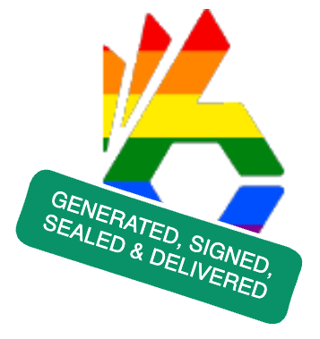
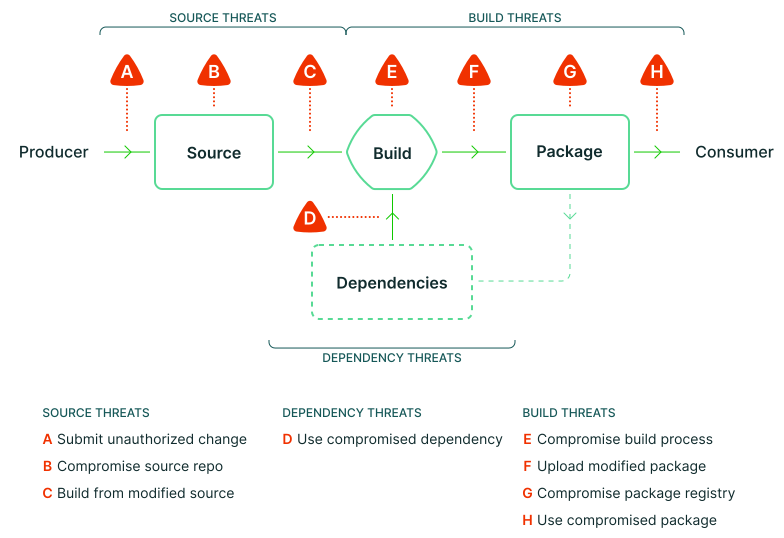
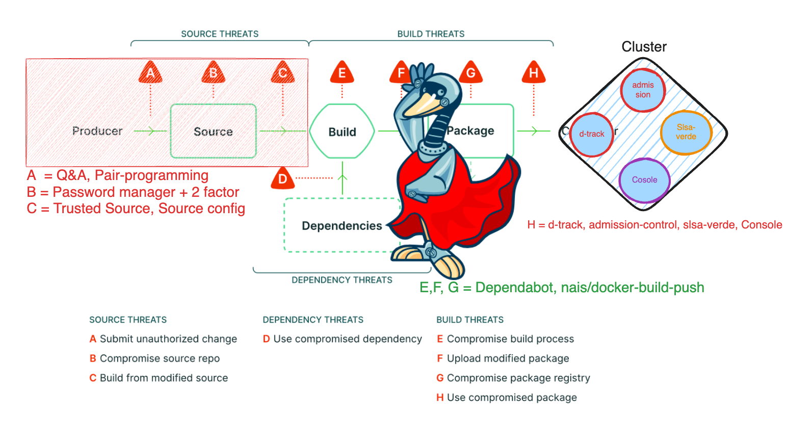
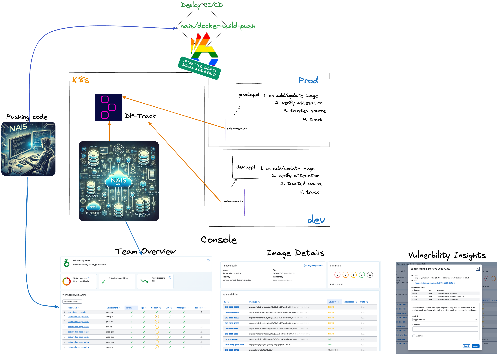

The [Nais](https://docs.nais.io/) platform supports over 1,700 applications, ranging from simple web pages to complex
data processing systems, built by more than 250 teams. These teams differ in size and focus—some prioritize security,
while others emphasize speed and agility.

Our goal is to ensure every application on the platform is both secure and reliable. This means giving teams the tools
they need to identify and fix vulnerabilities quickly and efficiently.

## The Nais golden path

There are many ways for a malicious actor to compromise an application, even before the code is committed. From A to H,
there are numerous potential vulnerabilities that we must be aware of and proactively address.

[slsa-threats-overview](https://slsa.dev/spec/v1.0/threats-overview)

By collaborating with our AppSec team, we work to identify the most common methods attackers use to compromise code and
implement measures to prevent them.

### Secure by design

To achieve this, we secure every layer of the platform infrastructure. This includes enforcing security policies across
clusters and namespaces with tools like network policies with egress control, pod security policies, and RBAC. Hardened
container images provide a secure foundation, and tools like [TokenX](https://docs.nais.io/auth/tokenx/),
which facilitates secure token exchange between applications for maintaining strict access control, strengthen
application-level security.

We also introduced [Texas](https://docs.nais.io/auth/explanations/?h=texas#texas), which stands for Token Exchange as a
Service. It simplifies the process of working with OAuth 2.0 and JWTs, handling the complexities of user authentication
and authorization so our teams doesn’t have to, following  
`The Nais golden path`.

## From concept to implementation

It all started with an idea from my colleague Tommy: What if we could sign container images before pushing them to a
registry and then scan them for vulnerabilities? The results could be displayed in an intuitive interface, making it
easier for teams to take action. It might not have been exactly like that, but that’s how I remember it.

In June 2021, Google introduced the [SLSA](https://slsa.dev/) (Supply-chain Levels for Software Artifacts) framework.
Inspired by this, we focused on three key goals:

* Automated Image Signing: Automatically sign container images in the CI/CD pipeline.
* Vulnerability Scanning: Scan the Software Bill of Materials ([SBOM](https://www.cisa.gov/sbom)) to detect
  vulnerabilities.
* Searchable Vulnerability Visibility: Enable teams to easily find and view vulnerabilities in their applications.

## The journey

### Early challenges and solutions

Our dependency tracking journey began in December 2021. We aimed to automate every step from code commit to deployment,
giving teams detailed insights into their applications' vulnerabilities and dependencies.

This approach gained urgency with the discovery of the Log4Shell vulnerability in November 2021. Initially, we relied on
scripts to locate affected workloads. For example, [Terje](https://github.com/terjesannum/scan-log4j) proposed scanning
container filesystems for vulnerable Log4j
JAR files. While effective, we recognized the need for proactive solutions.

### Tool integration and custom Solutions

We started with a simple goal: detect an application’s programming language, generate an SBOM, and securely sign both
the SBOM and the container image before uploading them to the registry. Signing was challenging,
but [Cosign](https://www.sigstore.dev/) from Sigstore (released in 2021) proved to be a perfect fit due to its
simplicity and reliability.

By October 2021, Trivy introduced SBOM generation for container images. This allowed us to shift focus to other
priorities. We integrated [Trivy](https://trivy.dev/latest/) for both vulnerability scanning and SBOM generation,
accelerating our progress.

To visualize vulnerabilities, we turned to the [OWASP Dependency-Track](https://dependencytrack.org/) project. Using its
REST API, we populated data and built a custom visualization in the Nais Console. This interface focuses on active
workloads in clusters and their vulnerabilities.

### Custom cluster monitoring: Slsa-verde

To further enhance security, we developed slsa-verde, a Kubernetes cluster monitor inspired by the SLSA framework. Its
key responsibilities include:

* Monitoring Workloads: Actively tracks container images used in Kubernetes clusters.
* Verifying Image Attestations: Ensures images are signed by trusted entities.
* Integrating with Dependency-Track: Extracts SBOMs from images, submits them for analysis.
* Data Synchronization: Maintains real-time records of active images and aligns them with Kubernetes applications.

This tool ensures that vulnerability data is accurate, up-to-date, and actionable, helping teams respond quickly to
potential threats.

### Details

* Nais developers push their code to GitHub.
* A [Nais action](https://github.com/nais/docker-build-push) builds the code, creates an SBOM, and signs the container
  image.
* The attestation can be tracked in the [Rekor transparency log](https://docs.sigstore.dev/logging/overview/).
* The container image and SBOM are uploaded to the container registry.
* The workload is deployed to the Nais platform.
* SLSA-verde watches for new workloads in the cluster.
* SLSA-verde verifies the image signature, checks its source, and extracts the SBOM.
* SLSA-verde sends the SBOM to Dependency-Track for analysis.

Developers can view vulnerabilities directly in the Nais Console. The entire process, from pushing code to seeing
vulnerability insights, takes only a few minutes, depending on the size of the image and the actions performed.

## Nais to have

* Visualize historical data to monitor vulnerabilities over time.

* Track data from the commit where the vulnerability was introduced.
    * Record when the vulnerability was fixed.
    * Measure lead time for resolving vulnerabilities.
    * Track when the vulnerability was first deployed.

* Provide alerts and notifications management in the Nais Console.
    * Enable filtering of alerts by cluster and severity.
    * Deliver alerts to preferred channels (e.g., Slack, email, etc.).

## Next step

Increase awareness among teams about vulnerabilities in their applications with real-time insights.
This is not always so simple due to a large number of applications and teams, in a medium-sized organization.
We are working on improving our communication channels to ensure that teams are aware of the vulnerabilities in their
applications and is proactive in addressing them. To achieve this, we plan to:

* Require all applications to include an SBOM.
* Block deployments of images without an SBOM.
* Provide teams with [more tools](#nais-to-have) to prepare for the next zero-day.
* Enforce stricter deployment restrictions for applications with critical vulnerabilities.

## Conclusion

Building a secure platform that supports over 1,700 applications across 250 teams is a complex and ongoing challenge. At
Nais, we work to ensure every application is secure and reliable by giving teams the tools they need to quickly find and
fix vulnerabilities.

From the start, we’ve focused on securing every layer of our platform. Tools like TokenX and Texas make token exchanges
and authentication easier, while frameworks like SLSA help us automate key processes like image signing, SBOM
generation, and vulnerability scanning to secure the software supply chain.

Using tools like Trivy and OWASP Dependency-Track, we’ve improved visibility into vulnerabilities and dependencies.
Custom solutions like slsa-verde strengthen security by monitoring Kubernetes clusters, verifying images, and keeping
vulnerability data accurate and actionable.

As new threats emerge, we continue to adapt. By working with our AppSec team, we identify common risks and take steps to
prevent them. Next, we plan to require SBOMs for all applications, block deployments without them, and enforce stricter
controls for critical vulnerabilities. We’re also improving communication and real-time alerts to help teams respond
quickly to threats.

Our goal is simple: to create a secure, reliable platform that helps teams build better applications while staying ahead
of potential risks.