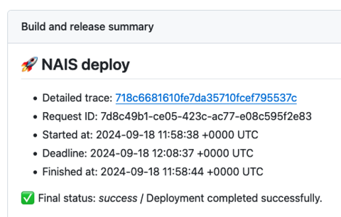
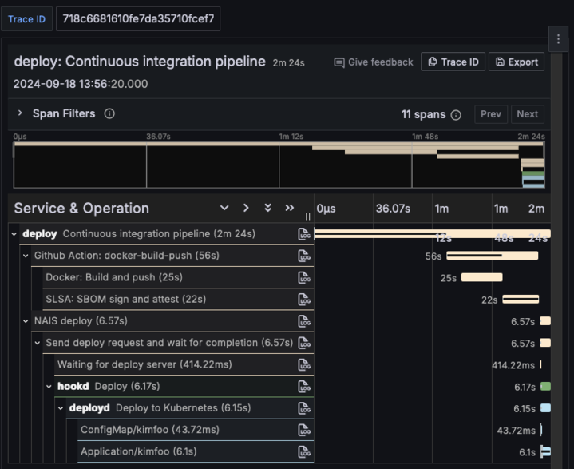

:otel: Tracing i NAIS deploy :nais:

Vi har lagt inn støtte for tracing i NAIS deploy samt docker-build-push, så nå framover vil du ha tilgang på nøyaktig hvor lang tid ting tar i pipelinen din, og besvare følgende:
- Hvor lang tid tok det før committen kom i produksjon?
- Hvor lang tid tar det å bygge Docker-imaget?
- Hvor lang tid tar SLSA SBOM sign & attest?
- Hvor lang tid må jeg vente på at min applikasjon rulles ut i clusteret?

Ut av boksen får man kun svar på det siste punktet, men hvis du følger vår enkle guide til integrering av telemetry så får du all data som er tilgjengelig! :rocket:

Link til tracing-dashboard dukker opp som et GitHub step summary når deploy-jobben er fullført.

Kom gjerne med tilbakemeldinger på om dette er nyttig for deg eller hva som kunne gjort det bedre :smile:

 

