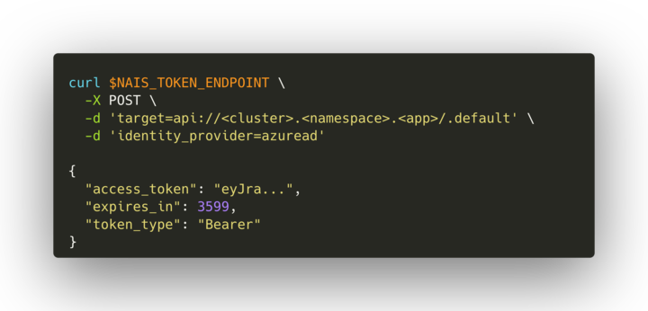
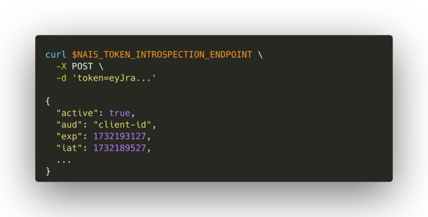
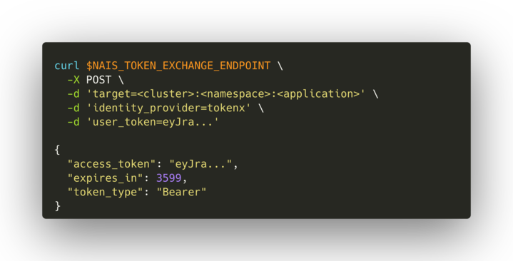

Token Exchange as a Service (Texas :texas: )

De fleste applikasjoner som trenger autentisering må i dag forholde seg til mange detaljer rundt OAuth og JWTer. For å gjøre det lett å gjøre rett så har vi nå laget en tjeneste som abstraherer vekk alt dette bak et enkelt HTTP API.

Tjenesten er en sidecar som kjører sammen med appen din og er kun tilgjengelig i kjøretid på Nais. APIet har tre endepunkt som tilgjengeliggjøres som miljøvariabler:
- NAIS_TOKEN_ENDPOINT lar deg hente et maskin-til-maskin token
- NAIS_TOKEN_EXCHANGE_ENDPOINT lar deg bytte inn et token med sluttbrukerkontekst mot et nytt on-behalf-of-token
- NAIS_TOKEN_INTROSPECTION_ENDPOINT validerer et token og returnerer tilhørende claims som JSON
Skjermbildene under illustrerer enkel bruk av APIet via `curl`.

    
 

Texas er foreløpig i beta og kun tilgjengelig ved opt-in.
Bli med i #texas hvis du vil bidra til at tjenesten blir så nais som mulig!

[Les mer og kom-i-gang i dokumentasjonen](https://doc.nais.io/auth/explanations/#texas)